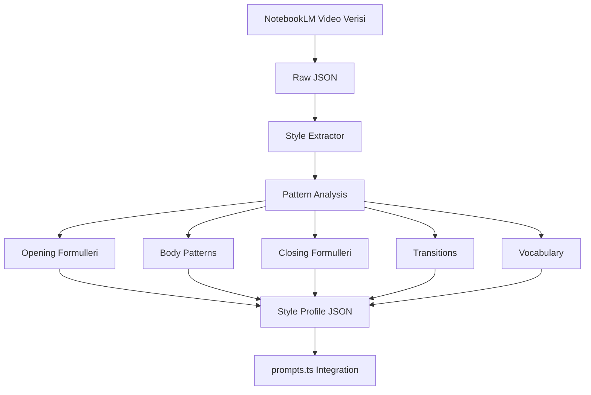

# İçerik Üretim Sistemi - İhtiyaç Haritası ve Plan

## 1. İHTİYAÇ HARİTASI

### 1.1 Üretilen Ürünler
```
Kullanıcı İsteği
    ↓
[Platform] + [Content Type] + [Style] + [Language]
    ↓
Copy-Paste Kullanılabilir İçerik
```

### 1.2 Değişkenler (Dimensions)

| Dimension | Değerler | Öncelik |
|-----------|----------|---------|
| **Platform** | Instagram, TikTok, YouTube, Twitter, LinkedIn | Yüksek |
| **Content Type** | Reel, Short, Post, Caption, Thread, Script | Yüksek |
| **Style Source** | Oğuz Usta, Baykuş, Umut Çoğan, ... | Yüksek |
| **Language** | TR, EN | Orta |
| **Trends** | Opsiyonel güncel trendler | Düşük |

### 1.3 Style Extraction Girdileri
Gerçek videolardan çıkarılacak:
- **Giriş Formülleri**: "Gençler selamlar herkese"
- **Kapanış Formülleri**: "Görüşürüz"
- **Geçiş Kelimeleri**: "Şimdi gençler...", "Peki..."
- **Hitap Şekilleri**: "abi", "gençler", "canım"
- **Cümle Kalıpları**: Açıklama, vurgu, samimiyet
- **Emoji Kullanımı**: Hangi emojiler, ne sıklıkla
- **Sayı Kullanımı**: "35 net", "120 gün" formatları
- **Hikaye Anlatımı**: Örnek hikaye yapıları

---

## 2. VERİ ANALİZ AKIŞI



---

## 3. İÇERİK KATEGORİZASYONU

### 3.1 Oğuz Usta İçerik Türleri (Video Başlıklarından)

| Kategori | Örnekler | Özellikler |
|----------|----------|------------|
| **Soru-Cevap** | "1 soruya kaç dakika...", "Kaç saat uyumalıyım?" | Doğrudan cevap, kısa |
| **Taktik/Rehber** | "AYT fizik nasıl çalışılır?", "20 saatte TYT sosyal" | Adım adım, kaynak önerili |
| **Motivasyon/Zihniyet** | "Stres güzeldir", "Her gün nasıl 10+ saat çalışıyorum" | Hikaye örnekli |
| **Deneme Analizi** | "Deneme çözme sırası", "Deneme analizi nasıl yapılır" | Pratik odaklı |
| **Program/Plan** | "120 günde AYT bitir", "15 tatil özel plan" | Takvimli, hedefli |
| **Kaynak Önerisi** | "En iyi geo soru bankası?", "YKS YouTube kanal önerileri" | Karşılaştırmalı |
| **Seviye Özels** | "11'lere özel", "Düşük netlerdeysen", "EA'cı TYT fen çalışmalı mı?" | Hedef kitle belirli |
| **Konuk Görüşmesi** | USTACAST serisi | Hikaye odaklı |

---

## 4. PROMPT ŞABLONU YAPISI

### 4.1 İstenen Yapı
```typescript
interface StyleProfile {
  meta: {
    source: string;        // "oguz_usta"
    sampleSize: number;    // 223 video
    extractedAt: string;
  };

  opening: {
    formulas: string[];    // ["Gençler selamlar herkese", ...]
    hooks: string[];       // ["Bu hatadan kaçın", ...]
  };

  body: {
    sentencePatterns: {
      explanation: string[];  // ["Hani şöyle...", "Yani..."]
      emphasis: string[];     // ["Asla...", "Kesinlikle..."]
      casual: string[];       // ["Valla...", "Olm..."]
    };
    structure: string[];     // ["3-5 madde", "Madde madde ilerleme"]
  };

  closing: {
    formulas: string[];     // ["Görüşürüz", "Seviliyorsunuz 💜"]
  };

  transitions: string[];    // ["Şimdi gençler...", "Peki..."]

  vocabulary: {
    addressTerms: string[]; // ["gençler", "abi", "canım"]
    commonWords: string[];  // ["net", "deneme", "başla"]
  };

  contentTypes: {
    [category: string]: {
      characteristics: string[];
      exampleStructure: string;
    };
  };

  style: {
    emoji: string[];
    numberFormat: string;   // "35 net", "120 gün"
    tone: string;           // "samimi, kardeş gibi"
  };
}
```

---

## 5. IMPLEMENTASYON ADIMLARI

### Phase 1: Style Extractor Script
- [ ] `scripts/extract_style.py` oluştur
- [ ] JSON veriden kalıpları çıkar (LLM kullanmadan önce regex ile)
- [ ] Çıkarılan kalıpları `data/style_profiles/` klasörüne kaydet

### Phase 2: LLM Destekli Analiz
- [ ] Claude API ile derin stil analizi
- [ ] Her içerik kategorisi için özel şablonlar
- [ ] Güvenilir kalıpları filtrele

### Phase 3: prompts.ts Yeniden Yapılanma
- [ ] StyleProfile tipi ekle
- [ ] StyleLoader ile JSON'dan yükleme
- [ ] buildSystemPrompt'u profile göre çalışır hale getir

### Phase 4: Test ve Doğrulama
- [ ] Gerçek Oğuz Usta videoları ile karşılaştırma
- [ ] Yanlış "kanka" gibi hataları temizleme
- [ ] İçerik üretim testleri

---

## 6. SORULAR

1. **Veri Kaynağı**: Başlıklar mı yoksa tam transkript mi kullanılmalı?
2. **Kategorizasyon**: Manuel mi yoksa otomatik mi?
3. **Validasyon**: Gerçek videolarla kıyaslamak için kaç örnek?
